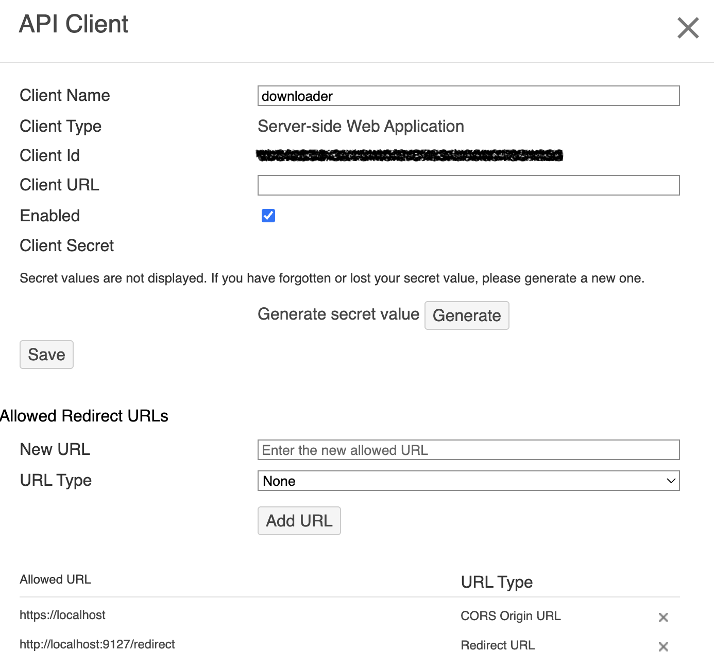

# Bulk Panopto Downloader

## Dependencies

It's recommended to create a virtual environment for running this (and, in fact, most python things):

```
python -m venv .venv
source .venv/bin/activate
```

Install all dependencies via

```
pip install -r requirements.txt
```

## Authentication

First, you need to have a Panopto API client. Log into Panopto and from `User Settings` click on `API Clients` and then `Create a New API Client`. My settings for the client are as follows:



Namely, the `CORS Origin URL` should be set to `https://localhost` and the `Redirect URL` to `http://localhost:9127/redirect`.

It'll then show you the client ID, name, and client secret. Copy these values down to a new JSON file with the following structure:

```
{
  "name": "<your client name here>",
  "client_id": "...",
  "client_secret": "...",
}
```

Save the JSON file in a known secure directory. By default, the script will look for this file as `~/.panopto_tokens`.

## Configuration

All configuration for this script is stored as constants at the top of `download.py`.

`DOWNLOAD_DESTINATION`: Location for the downloads. A directory tree mirroring what you have access to in Panopto will be created here. Panopto folders with slashes will be renamed to have dashes instead.

`CREDS_FILE`: The path to the API client credentials (see above).

`SERVER`: The domain for the panopto server to download from, excluding protocol (https, etc.)

`SKIP_FOLDERS`: List of names of any folders you want to skip. 

## Running

Main entry point is `download.py`. Run it with

```
python download.py
```

No command line arguments are required, as all configuration is via variables in the script.

## Debugging

The default log level is INFO, overridable via the `init_logger` function in `download.py`. Setting the log level to DEBUG gives you **WAY** more info on the console, but also disables the actual file downloads. Helpful in case something goes horribly wrong.

## Caveats and Notes

* A lot of this script was a number of modifications on top of [an example set of scripts](https://github.com/Panopto/panopto-api-python-examples) I found a while back. My fork of that (included in this repository) has substantially diverged from that, but may still have some crusty bits around the edges.

* [The embedded Panopto library](panopto/) contains more than just download, including delete, rename, and more. The downloaded only uses the read-only methods.

* The Panopto API rate limits at 100 / minute (or at least UW's does). The default rate limit in this downloaded is set at 80% of that to provided a little wiggle room. Override this via the `REQUESTS_PER_MINUTE` constant at the top of [panopto/panopto_client.py](panopto/panopto_client.py).

* The downloader makes a crude attempt at determining whether or not to download a given session: if the `Content-Length` in the session's headers matches the on-disk file size, then the download is skipped. For various reasons, this is not entirely accurate, but does an "okay" job.

* This script is provided AS-IS, and as such the user should assume no support from the author.

## Known Bugs

* The local directory tree currently doesn't mirror the hierarchy in Panopto. Local paths are based on the remote folders' names rather than paths.
